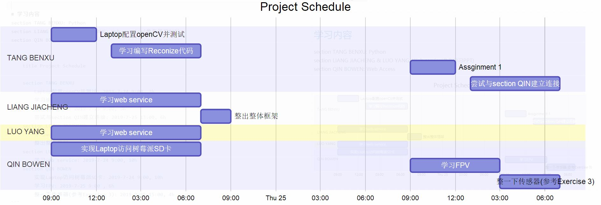

# 在此处输入标题

标签（空格分隔）： NUSProgramManagement


---

# 学习内容
section TANG BENXU: Python
section LIANG JIACHENG & LUO YANG: Web service(参考学习PPT)
section QIN BOWEN: Web Access

```gantt
    title Project Schedule
    
    section TANG BENXU
        Laptop配置openCV并测试: 2019-7-24 9:00, 3h
        学习编写Reconize代码: 2019-7-24 13:00, 6h
        Assginment 1: 2019-7-25 9:00, 3h
        尝试与section QIN建立连接: 2019-7-25 13:00, 6h
    section LIANG JIACHENG
        学习web service: 2019-7-24 9:00, 10h
        整出整体框架: 2019-7-24 19:00, 2h
    section LUO YANG 
        学习web service: 2019-7-24 9:00, 10h
    section QIN BOWEN
        实现Laptop访问树莓派SD卡: 2019-7-24 9:00, 10h
        学习FPV: 2019-7-25 9:00 , 6h
        整一下传感器(参考Exercise 3): 2019-7-25 15:00, 4h
```


