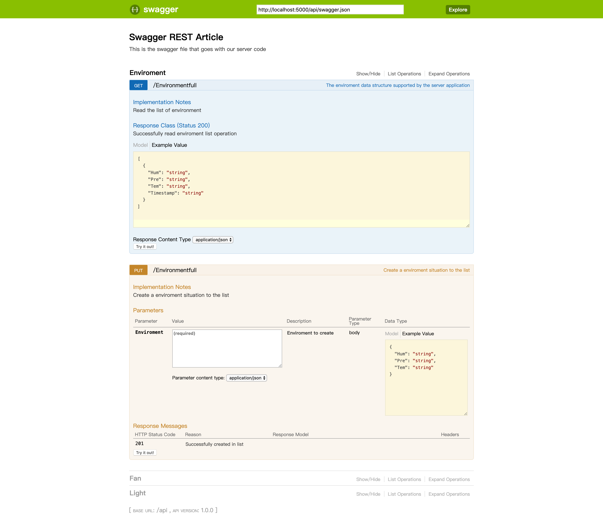

# RESTFUL SERVICE 的搭建 & 服务端JSON处理

本处 RESTFUL SERVICE 采用了Swagger UI的框架，可以实现简单的HTTP(HTTPS)请求，并可以在LOCALHOST上运行，本处根据实际需要，只保留了GET和PUT的功能，并去掉掉PUT中的重复审查，并部署在云端服务器上。

## Swagger UI框架

LINK:https://swagger.io/tools/swagger-ui




本处框架改用https协议

### 运行代码(Python)

```python
import connexion

app = connexion.App(__name__, specification_dir='./')

app.add_api('swaggerfull.yml')

@app.route('/')
def index():
	return 'index'

if __name__ == '__main__':
    app.run(host='0.0.0.0',port=5000, debug=True)

```

### YML框架文件(根据需要修改，此处功能已阉割)

```yaml
swagger: "2.0"
info:
  description: This is the swagger file that goes with our server code
  version: "1.0.0"
  title: Swagger REST Article
consumes:
  - "application/json"
produces:
  - "application/json"

basePath: "/api"

# Paths supported by the server application
paths:
  /Environmentfull:
    get:
      operationId: "Environmentfull.read"
      tags:
        - Enviroment
      summary: The enviroment data structure supported by the server application
      description: Read the list of environment
      responses:
        200:
          description: Successfully read enviroment list operation
          schema:
            type: "array"
            items:
              properties:
                Tem:
                  type: "string"
                Hum:
                  type: "string"
                Pre:
                  type: "string"
                Timestamp:
                  type: "string"
    put:
      operationId: Environmentfull.create
      tags:
        - Enviroment
      summary: Create a enviroment situation to the list
      description: Create a enviroment situation to the list
      parameters:
        - name: Enviroment
          in: body
          description: Enviroment to create
          required: True
          schema:
            type: object
            properties:
              Tem:
                type: string
                description: Temperture
              Hum:
                type: string
                description: Humidity
              Pre:
                type: string
                description: Pressure
      responses:
        201:
          description: Successfully created in list


  /Light:
    get:
      operationId: "Light.read"
      tags:
        - Light
      summary: The Light data structure supported by the server application
      description: Read the list of Light
      responses:
        200:
          description: Successfully read Light list operation
          schema:
            type: "array"
            items:
              properties:
                Ligcon:
                  type: "string"
                State:
                  type: "string"
                Timestamp:
                  type: "string"
    put:
      operationId: Light.create
      tags:
        - Light
      summary: Create a Light situation to the list
      description: Create a Light situation to the list
      parameters:
        - name: Light
          in: body
          description: Light to create
          required: True
          schema:
            type: object
            properties:
              Ligcon:
                type: string
                description: Light Light
              State:
                type: string
                description: Light State
      responses:
        201:
          description: Successfully created in list  
          
          
  /Fan:
    get:
      operationId: "Fan.read"
      tags:
        - Fan
      summary: The Fan data structure supported by the server application
      description: Read the list of Fan
      responses:
        200:
          description: Successfully read Fan list operation
          schema:
            type: "array"
            items:
              properties:
                Speed:
                  type: "string"
                State:
                  type: "string"
                Timestamp:
                  type: "string"
    put:
      operationId: Fan.create
      tags:
        - Fan
      summary: Create a Fan situation to the list
      description: Create a Fan situation to the list
      parameters:
        - name: Fan
          in: body
          description: Fan to create
          required: True
          schema:
            type: object
            properties:
              Speed:
                type: string
                description: Fan Speed
              State:
                type: string
                description: Fan State
      responses:
        201:
          description: Successfully created in list      
        
```

### Environment.py文件，其他同理

```python
from datetime import datetime

from flask import make_response, abort

def get_timestamp():
	return datetime.now().strftime(('%Y-%m-%d %H:%M:%S'))
	
ENVIRONMENT = {
    'One': {
        'Tem': 'test',
        'Hum': 'test',
		'Pre': 'test',
		'Timestamp': get_timestamp()
    },

}


def read():
	'''
	This function responds to a request for /api/people
	with the complete lists of people

	:return:        sorted list of people
	'''
	# Create the list from our data
	return [ENVIRONMENT[key] for key in sorted(ENVIRONMENT.keys())]


def create(Enviroment):

	Tem = Enviroment.get("Tem", None)
	Hum = Enviroment.get("Hum", None)
	Pre = Enviroment.get("Pre", None)


	ENVIRONMENT[Tem] = {
		"Hum": Hum,
		"Pre": Pre,
		"Tem": Tem,
		'Timestamp': get_timestamp()
	}
	return make_response('successfully created')
```

## 服务端代码(建议参考Run_on_Rpi/Fan_Rpi.py，包含了PUT和GET的处理)，此处节选

### GET & PUT 简单函数

```python
def http_get():
    url='https://nussh.happydoudou.xyz:5000/api/Fan'
    response = urllib2.urlopen(url,context=context)
    return response.read()

def http_put():
    url='https://nussh.happydoudou.xyz:5000/api/Environmentfull'
    values={
        "Hum": "{0:0.2f}".format(humidity),
        "Pre": "{0:0.2f}".format(hectopascals),
        "Tem": "{0:0.3f}".format(degrees),
    }
    jdata = json.dumps(values)# 对数据进行JSON格式化编码
    request = urllib2.Request(url, jdata)
    request.add_header('Content-Type', 'application/json')
    request.get_method = lambda:'PUT'# 设置HTTP的访问方式
    request = urllib2.urlopen(request, context = context)
    print("Success Put!")
    return request.read()
```

### 此处使用定时函数，定时异步运行代码(包含JSON数据处理)

```python
def TimeFan():
    #sensor = BME280(t_mode=BME280_OSAMPLE_8, p_mode=BME280_OSAMPLE_8, h_mode=BME280_OSAMPLE_8)
    global degrees,pascals,hectopascals,humidity
    degrees = sensor.read_temperature()
    pascals = sensor.read_pressure()
    hectopascals = pascals / 100
    humidity = sensor.read_humidity()

    #time.sleep(0.1)
    print ('Temp      = {0:0.3f} deg C'.format(degrees))
    #print ('Pressure  = {0:0.2f} hPa'.format(hectopascals))a
    #print ('Humidity  = {0:0.2f} %'.format(humidity))

    ret = http_get()
    global state
    Fanlin=json.loads(ret.decode('utf-8'))

    for dict_data in Fanlin:
        print(dict_data)
        print("\n")
#JSON数据处理************************************************
    time="0000-00-00 00:00:00"
    Speed=[]
    State1=[]
    Timestamp=[]

    index=0

    for dict_data in Fanlin:
        Speed.append(dict_data['Speed'])
        State1.append(dict_data['State'])
        Timestamp.append(dict_data['Timestamp'])

    for i ,value in enumerate(Timestamp):
        if value>time:
            index=i
            time=value

    
    print(Speed[index]+'<<<<<<'+State1[index])

    if State1[index]=='0':
        state=0
        Fansp=int(Speed[index])
    elif State1[index]=='1' and state==0:
        state=1
        
    a=int(GPIO.input(23))
    if a>0:
        print("sb")
        if state>=2:
            state=1
        else:
            state=state+1
    if state==0:
        p.ChangeDutyCycle(Fansp)
    elif state==1:
        servalue = Caculator(degrees)
        p.ChangeDutyCycle(servalue)
    else:
        print(int(pot.value*20)*5)
        p.ChangeDutyCycle(int(pot.value*20)*5)

    
        #启动定时器任务，每一秒执行一次
    Timer(1, TimeFan).start()

        
def TimePut(logfile = None):
    global degrees,pascals,hectopascals,humidity
    http_put()
    #启动定时器任务，每十秒执行一次
    Timer(10, TimePut).start()


TimeFan()
TimePut()

```

